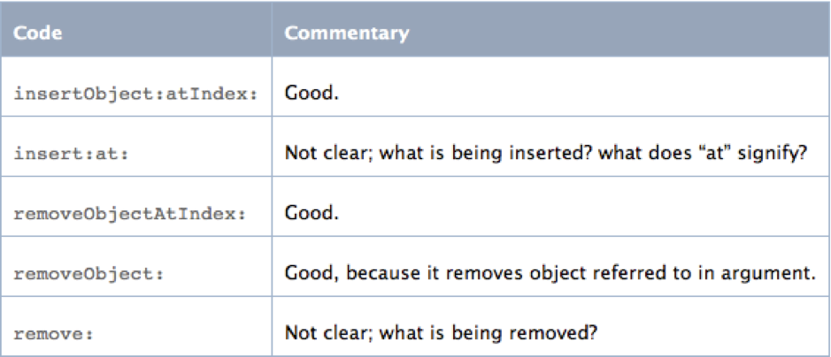
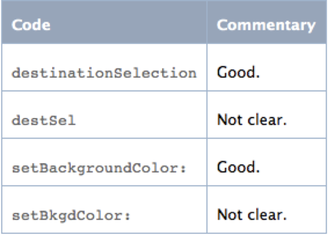
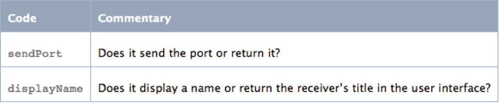

iOS编码规范
==

	Objective C的代码需要有良好的自解释性，清晰的命名和文档结构，少量的注释。
方法命名
-
 
1.1 方法名首字母小写,其他首字母大写

	DosomethingWithParam: (不合适，首字母要小写，之后要使用首字母大写)
	doSomethingWithParam: (合适)
	

图1.1.1 简短清晰的同时要保证语意的清晰

图1.1.2 大多数时候使用全拼而不是缩写，即使他们很长

图1.1.3 避免产生歧义的命名
	
 
变量命名
-
2.1 变量名首字母小写,后续首字母大写，"*"和变量名之间不空格

	@property (atomatic, retain) NSString * myDevice (不合适，"*"和变量名之间不空格)
	@property (atomatic, retain) NSString *MyDevice (不合适，首字母要小写，之后要使用首字母大写)
	NSString *VarName;: (不合适，首字母要小写，之后要使用首字母大写)
	NSString *userName; (合适)
	
2.2 成员变量使用“_”作为前缀，临时变量不需要“_”前缀

	NSString *varName; (当作为成员变量时，不合适，应使用“_”作为前缀)
	NSString *varName; (当作为临时变量时，合适，不需要“_”作为前缀)
	NSString *_varName; (当作为成员变量时 合适)

2.3 成员变量名不使用类型前缀或者“m”前缀（该规则同样适用于临时变量）,比如定义一个“设备数组”的成员变量： 

	NSArray *_arrDevice; (不合适，变量名不使用类型前缀) 
	NSString *_mDevice; (不合适，成员变量名不使用“m”前缀） 
	NSArray *_deviceArray; (合适，从名字可看出类型，符合变量的用途：“设备数组”)
 
类命名
-
3.1 类名首字母以及后续单词首字母大写

	homepageViewController (不合适，首字母需要大写)
	VSDevice （合适）
	
3.2 类名可使用简短的前缀，比如：项目名缩写，公司名缩写 (立项时，团队成员可共同拟定)

	KLMyClass (合适， 前缀使用了KLStudio的前两个字母) 
	VSHomePageViewController (合适，VS是项目名称缩写)

 
文件命名
-
4.1 类文件名称所有首字母大写，命名需要和它所实现的类的名字相同，同时需要体现出它的角色，比如控制器需要添加ViewController后缀，视图一般情况需要有View后缀（模型类不需要添加Model作为后缀）

	HomePage	 	(不合适，从名字不能看出它是一个控制器还是一个视图)
	HomePageViewController (合适，它是一个控制器角色)
	HomePageView 		(合适，它是一个视图角色)
	homePageViewController	(不合适，所有首字母需要大写)
	STBDeviceModel 		(不合适，它本身代表一个设备，不需要多余的“Model”后缀)
	STBDevice 		(合适，它是一个模型角色)

4.2 类别的文件名应该使用“类别名+类别功能说明”

	NSString+Utils.h 	(为NSString添加了一些工具方法的集合)
	NSString+MD5.h		(为NSString添加了MD5支持)
 	
其他
-
5.1 #define的宏作为key时(NSDictionary,NSUserDefault,NSCoding)，前面加"k"关键字；其他宏采用首字母大写，通知需要添加Notification后缀

	#define kUserName  @"UserName" (作为字典,NSUserDefault,NSCoding的key)
 	#define CanvasView_Tag 		10001
	#define ItunesURL  			@"http://www.itunesconnect.com"
	#define DeviceDidConnectedNotification		  @"DeviceDidConnectedNotification"

5.2 enums的枚举变量首字母大写，枚举变量带上有意义的枚举名作为前缀，之后是下划线，最后是参数名,枚举数值等号对齐

	typedef NS_ENUM(NSInteger, IDFMood) {
		happyMood = 0,
		grinMood,
		sadMood,
		madMood
	}; (不合适，首写字母没有大写 参数名前置不方便阅读)

	typedef NS_ENUM(NSInteger, IDFMood) {
		KLMood_Happy = 1<<0,
		KLMood_Grin = 1<<1,
		KLMood_Sad = 1<<2,
		KLMood_Mad = 1<<3 
	}; (不合适，枚举数值应从等号对齐)

	typedef enum {
		KLMood_Happy = 0,
		KLMood_Grin  = 1,
		KLMood_Sad   = 2,
		KLMood_Mad   = 3
	}KLMood; (合适)

5.3 界面控件采用 “功能＋控件名”的命名方式，且控件名使用完整拼写，举例如下：

	registerButton
	nameLabel

5.4 使用整形表示某种状态或类型时，需要采用枚举值；使用常量字符串需要在特定文件或实现文件的统一位置声明，也可以采用宏定义的方式声明常量字符串，避免代码出现“魔数”“魔字符串”

 
空格和对齐
-
6.1 property属性括号两边各空一格，属性关键字以逗号加空格分开

	@property(nonatomic, retain)NSString *foo;   (不合适，括号两边各空一格)
	@property (nonatomic,retain) NSString *foo;  (不合适，属性关键字以逗号加空格分开)
	@property (nonatomic, retain) NSString *foo; (合适)

6.2 赋值操作运算符两边有一个空格

	_myName=name; (不合适，＝ 两边没有空格)
	_myName = name; (合适)

6.3 头文件中，#import作为一块，@protocol和@class声明作为一块,@interface作为一块,其中属性之间不空格，方法之间空一格；@interface和@protocol之间空一行, @protocol如果要在头文件中声明，统一放在@interface下面，各模块空格和注释参考如下实现：

	#import <Foundation/Foundation.h>
	#import "MyClass.h"

	@protocol FooDelegate;
	@class IDFDocument;

	@interface IDFFoo : NSObject 

	@property (nonatomic, retain) NSString *foo;
	@property (nonatomic, assign) id<FooDelegate> delegate;

	+ (id)fooWithString:(NSString *)string;
	+ (id)fooWithString:(NSString *)string;

	//initialization
	+ (id)init;
	//init with a string
	+ (id)initWithString:(NSString *)string;

	@end

	@protocol FooDelegate <NSObject>

	- (void)iDFFooAskForReloadData:(IDFFoo *)foo;
	- (void)iDFFoo:(IDFFoo *)foo requestWithData:(NSData *)data error:(NSError *)error;

	@end

6.4 头文件中不出现私有变量申明，私有变量可在.m文件中以扩展的方式申明，如下MyClass.m文件中的私有变量申明：

	@interface MyClass()

	@property (nonatomic ,assign) NSString *privateParam;

	@end

    @implemention MyClass

	@end

6.5 实现文件中，#import作为一块，@synthesize作为一块，@synthesize和@implementation之间空一行，且采用@synthesize varName  = _varName 的方式；#pragma mark - XXX 写在一行，且和其他函数之间有空行，举例如下：

	#import "IDFFoo.h"
	#import "MyClass.h"

	@implementation IDFFoo

	@synthesize foo = _foo;
	@synthesize bar = _bar;
	@synthesize delegate = _delegate;

	#pragma mark - LifeCycle

	- (void)dealloc {
		[_foo release];_foo = nil;  //OR self.foo = nil;
		[_bar release];_bar = nil;  //OR self.bar = nil;
		[super dealloc];
	}

6.6 实现文件中，采用类似如下的方式对函数分组，确保每个函数都在合适的祖内：
	
	#pragma mark - LifeCycle (类的生命周期相关函数)
	
	- (instancetype)init;
	
	- (void)viewDidLoad;
	
	- (void)dealloc;
	
	- (void)setName;
	
	- (NSString *)name;
	
	#pragma mark - Private (私有函数，比如算法，工具函数等)
	
	- (void)helperMethod;
	
	- (void)aPrivateMethod;

	#pragma mark - Public (头文件中公开的函数)
	
	- (void)doSomething; // API in h file
	
	#pragma mark - Actions （UIControl的响应函数，比如按钮事件）
	
	- (void)voiceValuedDidChanged:(id)sender;
	
	- (void)startUpload:(id)sender;
	
	#pragma mark - Notification (通知的响应函数)
	
	- (void)deviceDidConnected:(NSNotification *)notification;
	
	#pragma mark - DelegateName (各种代理的实现方法)

	- (void)delegateCallback:(id)sender;

6.7 函数之间空一行，函数内部逻辑相关的代码块空一行, 函数的"{"建议放在函数同一行

	- (NSString *)foo {
		return _foo;
	}

	- (void)setFoo:(NSString *)newFoo {
		if (_foo != newFoo) {
			[_foo release];
			_foo = [newFoo retain];
		}

		//some other code block
	}

6.8 权限控制符@public 和@private 缩进一个空格.

	@interface MyClass : NSObject {  
	 @public  
	 ...  
	 @private  
	 ...  
	}  
	
	@end

6.9 在-或+和返回类型之间留一个空格,在*前留一个空格,其余地方不留空格

	-(void)doSomething; 	(不合适， -或+和返回类型之间要留一个空格)
	- (void) doSomething;	(不合适，“)”和 doSomething之间不空格)
	- (void)doSomething; 	(合适)
6.10 多个参数(>=3)的对齐使用XCode的默认对齐方式

 
约定
-
7.1 除非有不能删除的说明，注释的代码块在可用的模块中不应该出现

7.2 一个函数只做一件事，一个函数的实现不超过一屏

7.3 if 条件判断推荐使用 if (true) 写法

	推荐写法：
	if (true) {
	   //Do something...
	}
	
	不推荐写法：
	if (false) {
	   return;
	}
	//Do something...

 
版权与作者
-
8.1 在新建或已有的工程配置Organization Name栏填入公司英文名称，在偏好设置的帐户设置中使用自己的姓名全拼或昵称

8.2 使用开源代码时，保留版权信息

 
示例代码
-

[KLFoo.h](Resources/KLFoo.h)

[KLFoo.h](Resources/KLFoo.h)
